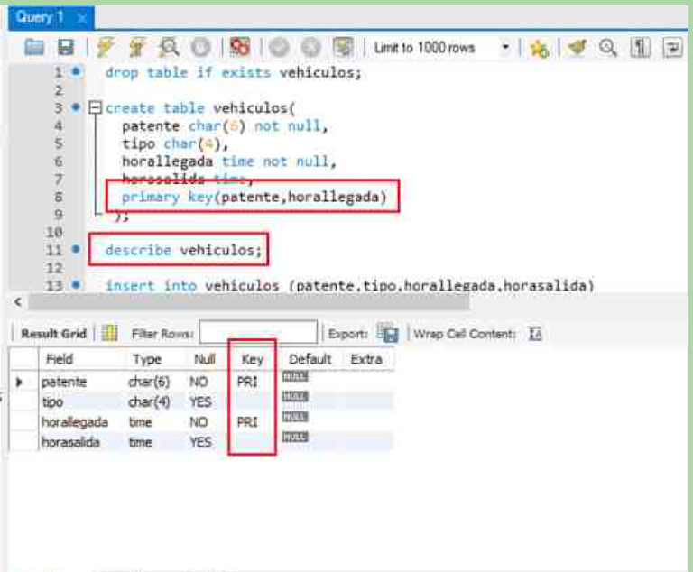

<h1>Clave Primaria Compuesta</h1>
<h2>Las claves primarias pueden ser simples, formadas por un solo campo o compuestas, más de un campo.

Recordemos que una clave primaria identifica 1 solo registro en una tabla. Para un valor del campo clave existe solamente 1 registro. Los valores no se repiten ni pueden ser nulos.

Retomemos el ejemplo de la playa de estacionamiento que almacena cada día los datos de los vehículos que ingresan en la tabla llamada "vehiculos" con los siguientes campos:

 - patente char(6) not null,
 - tipo char (4),
 - horallegada time not null,
 - horasalida time,
Necesitamos definir una clave primaria para una tabla con los datos descriptos arriba. No podemos usar la patente porque un mismo auto puede ingresar más de una vez en el día a la playa; tampoco podemos usar la hora de entrada porque varios autos pueden ingresar a una misma hora. Tampoco sirven los otros campos.
Como ningún campo, por si solo cumple con la condición para ser clave, es decir, debe identificar un solo registro, el valor no puede repetirse, debemos usar 2 campos.

Definimos una clave compuesta cuando ningún campo por si solo cumple con la condición para ser clave.

En este ejemplo, un auto puede ingresar varias veces en un día a la playa, pero siempre será a distinta hora.

Usamos 2 campos como clave, la patente junto con la hora de llegada, así identificamos unívocamente cada registro.

Para establecer más de un campo como clave primaria usamos la siguiente sintaxis:

 create table vehiculos(
  patente char(6) not null,
  tipo char(4),
  horallegada time not null
  horasalida time,
  primary key(patente,horallegada)
 );
Nombramos los campos que formarán parte de la clave separados por comas.

Si vemos la estructura de la tabla con "describe" vemos que en la columna "key", en ambos campos aparece "PRI", porque ambos son clave primaria.

Un campo que es parte de una clave primaria puede ser autoincrementable sólo si es el primer campo que compone la clave, si es secundario no se permite.

Es posible eliminar un campo que es parte de una clave primaria, la clave queda con los campos restantes. Esto, siempre que no queden registros con clave repetida. Por ejemplo, podemos eliminar el campo "horallegada":

 alter table vehiculos drop horallegada;
siempre que no haya registros con "patente" duplicada, en ese caso aparece un mensaje de error y la eliminación del campo no se realiza.

En caso de ejecutarse la sentencia anterior, la clave queda formada sólo por el campo "patente".

Servidor de MySQL instalado en forma local.
Ingresemos al programa "Workbench" y ejecutemos el siguiente bloque de instrucciones SQL donde creamos una tabla con clave primaria compuesta:

drop table if exists vehiculos;

create table vehiculos(
  patente char(6) not null,
  tipo char(4),
  horallegada time not null,
  horasalida time,
  primary key(patente,horallegada)
 );

describe vehiculos;

insert into vehiculos (patente,tipo,horallegada,horasalida)
  values('ACD123','auto','8:30','9:40');
insert into vehiculos (patente,tipo,horallegada,horasalida)
  values('AKL098','auto','8:45','11:10');
insert into vehiculos (patente,tipo,horallegada,horasalida)
  values('HGF123','auto','9:30','11:40');
insert into vehiculos (patente,tipo,horallegada,horasalida)
  values('DRT123','auto','15:30',null);
insert into vehiculos (patente,tipo,horallegada,horasalida)
  values('FRT545','moto','19:45',null);
insert into vehiculos (patente,tipo,horallegada,horasalida)
  values('GTY154','auto','20:30','21:00');

describe vehiculos;

insert into vehiculos (patente,tipo,horallegada,horasalida)
   values('ACD123','auto','16:00',null);

-- Intentamos ingresar un vehículo con clave primaria repetida:
insert into vehiculos (patente,tipo,horallegada,horasalida)
  values('ACD123','auto','16:00',null);

-- Si ingresamos un registro con hora de ingreso repetida, no hay problemas,
-- siempre que la patente sea diferente
insert into vehiculos (patente,tipo,horallegada,horasalida)
  values('ADF123','moto','8:30','10:00');

-- Intentamos eliminar el campo "horallegada"
-- No se puede porque quedarían registros con clave repetida.
alter table vehiculos drop horallegada;

-- Elimine los registros con patente "ACD123":
delete from vehiculos
  where patente='ACD123';

-- Intentamos nuevamente eliminar el campo "horallegada"
-- Ahora si lo permite.
alter table vehiculos drop horallegada;

describe vehiculos;<h2>

