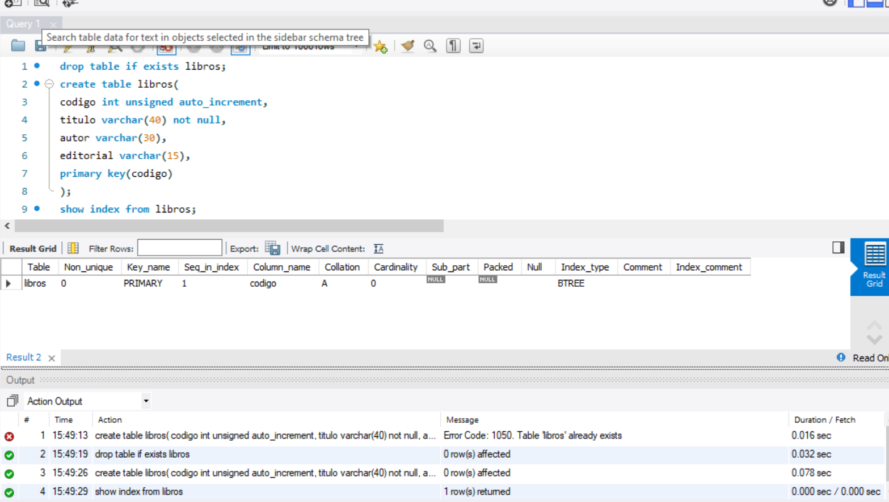

<h1> Indice de una tabla</h1>

<h3>Para facilitar la obtención de información de una tabla se utilizan índices.

El indice de una tabla desempeña la misma función que el índice de un libro: permite encontrar datos rápidamente; en el caso de las tablas, localiza registros.

Una tabla se indexa por un campo (o varios).

El índice es un tipo de archivo con 2 entradas: un dato (un valor de algún campo de la tabla) y un puntero.

Un índice posibilita el acceso directo y rápido haciendo más eficiente las búsquedas. Sin índice, se debe recorrer secuencialmente toda la tabla para encontrar un registro.

El objetivo de un indice es acelerar la recuperación de información.

La desventaja es que consume espacio en el disco.

La indexación es una técnica que optimiza el acceso a los datos, mejora el rendimiento acelerando las consultas y otras operaciones. Es útil cuando la tabla contiene miles de registros.

Los índices se usan para varias operaciones:

- para buscar registros rápidamente.

- para recuperar registros de otras tablas empleando "join".

Es importante identificar el o los campos por los que sería útil crear un indice, aquellos campos por los cuales se realizan operaciones de búsqueda con frecuencia.

Hay distintos tipos de índices, a saber:

1) "primary key": es el que definimos como clave primaria. Los valores indexados deben ser únicos y además no pueden ser nulos. MySQL le da el nombre "PRIMARY". Una tabla solamente puede tener una clave primaria.

2) "index": crea un indice común, los valores no necesariamente son unicos y aceptan valores "null". Podemos darle un nombre, si no se lo damos, se coloca uno por defecto. "key" es sinónimo de "index". Puede haber varios por tabla.

3) "unique": crea un indice para los cuales los valores deben ser únicos y diferentes, aparece un mensaje de error si intentamos agregar un registro con un valor ya existente. Permite valores nulos y pueden definirse varios por tabla. Podemos darle un nombre, si no se lo damos, se coloca uno por defecto.

Todos los índices pueden ser multicolumna, es decir, pueden estar formados por más de 1 campo.

En las siguientes lecciones aprenderemos sobre cada uno de ellos.

Una tabla puede tener hasta 64 índices. Los nombres de índices aceptan todos los caracteres y pueden tener una longitud máxima de 64 caracteres. Pueden comenzar con un dígito, pero no pueden tener sólo dígitos.

Una tabla puede ser indexada por campos de tipo numérico o de tipo caracter. También se puede indexar por un campo que contenga valores NULL, excepto los PRIMARY.

"show index" muestra información sobre los índices de una tabla. 
Por ejemplo:

 show index from libros; 
 
 El índice llamado primary se crea automáticamente cuando establecemos un campo como clave primaria, no podemos crearlo directamente. El campo por el cual se indexa puede ser de tipo numérico o de tipo caracter.

Los valores indexados deben ser únicos y además no pueden ser nulos. Una tabla solamente puede tener una clave primaria por lo tanto, solamente tiene un índice PRIMARY.

Puede ser multicolumna, es decir, pueden estar formados por más de 1 campo.

Veamos un ejemplo definiendo la tabla "libros" con una clave primaria:

 create table libros(
  codigo int unsigned auto_increment,
  titulo varchar(40) not null,
  autor varchar(30),
  editorial varchar(15),
  primary key(codigo)
 );
Podemos ver la estructura de los índices de una tabla con "show index". Por ejemplo:

 show index from libros;
Aparece el índice PRIMARY creado automáticamente al definir el campo "codigo" como clave primaria.

Servidor de MySQL instalado en forma local.
Ingresemos al programa "Workbench" y ejecutemos el siguiente bloque de instrucciones SQL:

drop table if exists libros;

create table libros(
  codigo int unsigned auto_increment,
  titulo varchar(40) not null,
  autor varchar(30),
  editorial varchar(15),
  primary key(codigo)
 );

show index from libros;
Genera una salida similar a esta:
 
 
 </h3>