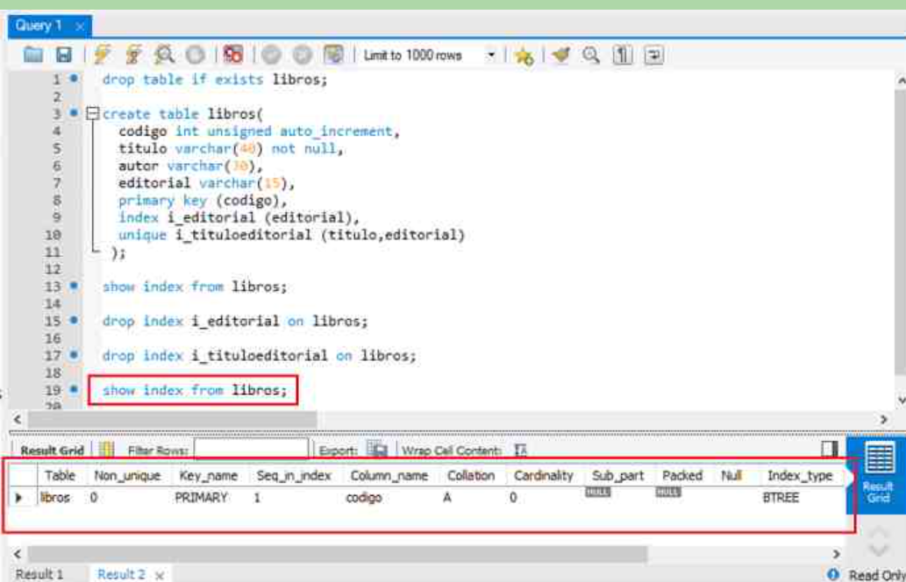

<h1>Borrar indice </h1>
<h3> Para eliminar un índice usamos "drop index". Ejemplo:

 drop index i_editorial on libros;
 drop index i_tituloeditorial on libros;
Se elimina el índice con "drop index" seguido de su nombre y "on" seguido del nombre de la tabla a la cual pertenece.

Podemos eliminar los índices creados con "index" y con "unique" pero no el que se crea al definir una clave primaria. Un índice PRIMARY se elimina automáticamente al eliminar la clave primaria (tema que veremos más adelante).

Servidor de MySQL instalado en forma local.
Ingresemos al programa "Workbench" y ejecutemos el siguiente bloque de instrucciones SQL que nos permiten eliminar índices definidos en una tabla:

drop table if exists libros;

create table libros(
  codigo int unsigned auto_increment,
  titulo varchar(40) not null,
  autor varchar(30),
  editorial varchar(15),
  primary key (codigo),
  index i_editorial (editorial),
  unique i_tituloeditorial (titulo,editorial)
 );

show index from libros;

drop index i_editorial on libros;

drop index i_tituloeditorial on libros;

show index from libros;</h3>

