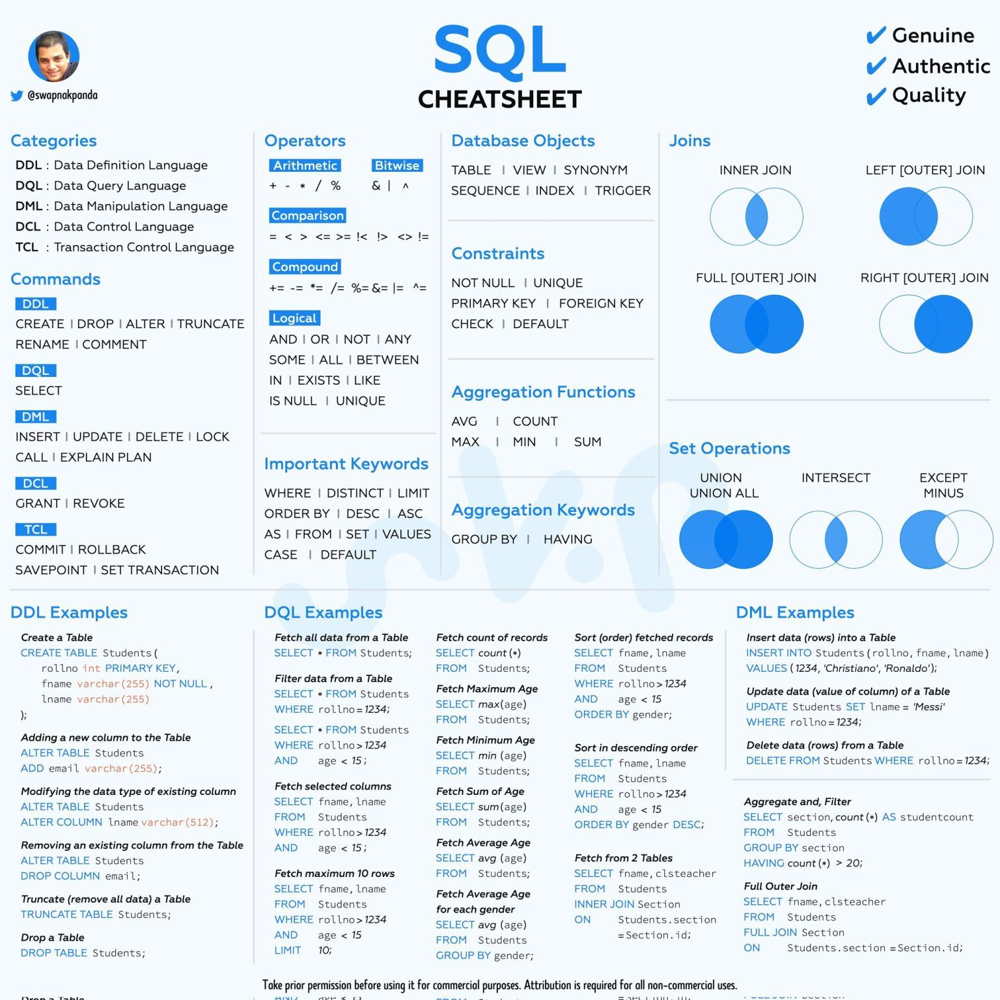

<h1> Material de SQL 
</h1>
<h2> Generamos consultas</h2>

<!-- 
SELECT: Permite realizar consultas sobre los datos almacenados en la base de datos
FROM: Indica de dónde se deben traer los datos y puede ayudar a hacer sentencias y filtros complejos cuando se quieren unir tablas.
WHERE:Se utiliza para hacer filtros en las consultas, es decir, seleccionar solamente algunas filas de la tabla que cumplan una determinada condición.-->

<h2> Clave Primaria: 
La clave primaria, PRIMARY KEY, identifica de manera única cada fila de una tabla.
La columna definida como clave primaria (PRIMARY KEY) debe ser UNIQUE (valor único) y NOT NULL (no puede contener valores nulos).
Cada tabla sólo puede tener una clave primaria (PRIMARY KEY).
Ejemplo PRIMARY KEY , clave primaria en MySQL</h2>

CREATE DATA BASE personas (dni int NOT NULL, nombre varchar(80) NOT NULL, apellidos varchar(80)NOT NULL, PRIMARY KEY (dni))
 Los operadores aritméticos son "+","-","*" y "/". Todas las operaciones matemáticas retornan "null" en caso de error. Ejemplo:

 select 5/0;
MySQL tiene algunas funciones para trabajar con números. Aquí presentamos algunas.

RECUERDE que NO debe haber espacios entre un nombre de función y los paréntesis porque MySQL puede confundir una llamada a una función con una referencia a una tabla o campo que tenga el mismo nombre de una función.

-abs(x): retorna el valor absoluto del argumento "x". Ejemplo:

 select abs(-20);
retorna 20.

-ceiling(x): redondea hacia arriba el argumento "x". Ejemplo:

 select ceiling(12.34),
retorna 13.

-floor(x): redondea hacia abajo el argumento "x". Ejemplo:

 select floor(12.34);
retorna 12.

-greatest(x,y,..): retorna el argumento de máximo valor.

-least(x,y,...): con dos o más argumentos, retorna el argumento más pequeño.

-mod(n,m): significa "módulo aritmético"; retorna el resto de "n" dividido en "m". Ejemplos:

 select mod(10,3);
retorna 1.

 select mod(10,2);
retorna 0.

- %: %: devuelve el resto de una división. Ejemplos:

 select 10%3;
retorna 1.

 select 10%2;
retorna 0.

-power(x,y): retorna el valor de "x" elevado a la "y" potencia. Ejemplo:

 select power(2,3);
retorna 8.

-rand(): retorna un valor de coma flotante aleatorio dentro del rango 0 a 1.0.

-round(x): retorna el argumento "x" redondeado al entero más cercano. Ejemplos:

 select round(12.34);
retorna 12.

 select round(12.64);
retorna 13.

-srqt(): devuelve la raiz cuadrada del valor enviado como argumento.

-truncate(x,d): retorna el número "x", truncado a "d" decimales. Si "d" es 0, el resultado no tendrá parte fraccionaria. Ejemplos:

 select truncate(123.4567,2);
retorna 123.45;

 select truncate (123.4567,0);
retorna 123.

Todas retornan null en caso de error. 

<h2>Ejercicios </h2>
<h3> Arbi </h3>

## ESTUDIAR TODO LOS CONTENIDOS YA VISTO

Comando DDL 

 

## Glosario 
